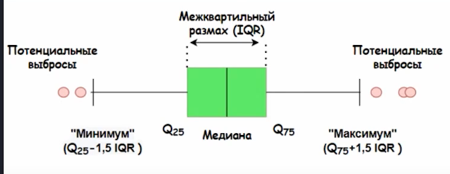
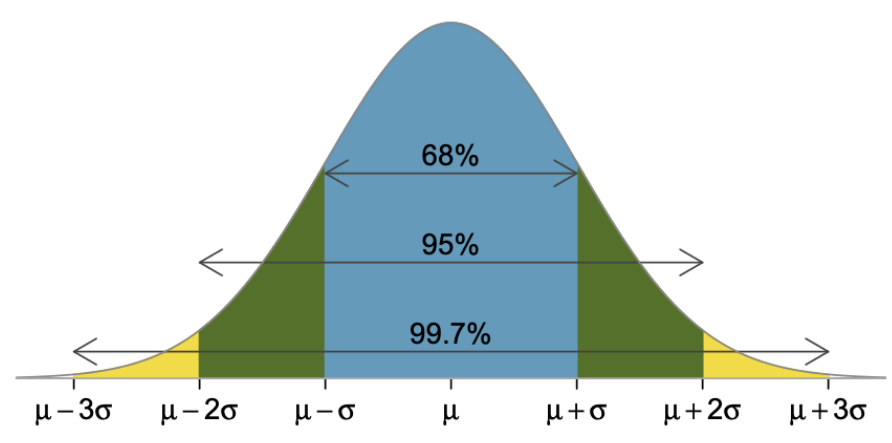

# Статистические методы поиска выбросов

## Понятие выброса
Одним из этапов очистки данных является поиск выбросов.

**Выброс (аномалия)** - это наблюдение, которое существенно выбивается из общего распределения и сильно отличается от других данных.

В данном разделе рассматриваются статистические методы поиска выбросов, а именно:
*  Метод межквартильного размаха
*  Метод z-отклонений (метод сигм)

## Метод межквартильного размаха (его еще называют методом Тьюки)


##### **На рисунке изображена коробчатая диаграмма (boxplot, box and whisker plot).**  Синонимичные названия диаграммы — ***ящик с усами*** и ***диаграмма размаха***. Для ее построения необходимо знать ***три характеристики:*** 1) $Q_{25}$ - 25 % квантиль; 2) $Q_{50}$ - 50 % квантиль, или медиана; 3) $Q_{75}$ - 75 % квантиль.

### Алгоритм метода:

1. Вычислить 25-ую и 75-ую квантили (первый и третий квартили) — $Q_{25}$ и $Q_{75}$ для признака, который мы исследуем
2. Bычислить межквартильное расстояние:
    * $IQR = Q_{75} - Q_{25}$
3. Определить верхнюю и нижнюю границы Тьюки:

    * $bound_{upper} = Q_{75} + 1.5*IQR$

    * $bound_{lower} = Q_{25} - 1.5*IQR$  

4. Найти наблюдения, которые выходят за пределы границ

### **Недостатки метода:**

Метод требует, чтобы признак, на основе которого происходит поиск выбросов, был распределен ***нормально***(гистограмма должна быть похожа на колокол) и требует от распределения примерной симметричности (чтобы у гистограммы были одинаковые хвосты в обе стороны).
### **Модификация метода:**

Можно попробовать воспользоваться методами преобразования данных, например, логарифмированием, чтобы попытаться свести рапределение к нормальному или хотя бы симметричному виду.

Также можно добавить вриативности количеству квартильных размахов в левую и правую сторону распределений.


## Метод z-отклонений (метод сигм)

Правило трёх сигм гласит: если распределение данных является нормальным, то 99,73% лежат в интервале: $(\mu-3 \sigma$, $\mu+3 \sigma)$, 
где
* ($\mu$) — математическое ожидание (для выборки это среднее значение)
* ($\sigma$) — стандартное отклонение. 

Наблюдения, которые лежат за пределами этого интервала, будут считаться выбросами.

Схематично правило трёх сигм для нормального распределения представлено на рисунке ниже:



### Алгоритм метода:

1. Bычислить математическое ожидание $\mu$(среднее) и стандартное отклонение $\sigma$ признака $x$;
2. Определить верхнюю и нижнюю границы:

    * $bound_{upper} = \mu+3 \sigma$

    * $bound_{lower} = \mu-3 \sigma$
3. Hайти наблюдения, которые выходят за пределы границ.

### **Недостатки метода:**

Метод требует, чтобы признак, на основе которого происходит поиск выбросов, был распределен ***нормально***
### **Модификация метода:**

Можно попробовать воспользоваться методами преобразования данных, например, логарифмированием, чтобы попытаться свести рапределение к нормальному или хотя бы симметричному виду.

Также можно добавить вриативности количеству квартильных размахов в левую и правую сторону распределений.

## Реализация методов

Методы реализованы в виде функций outliers_iqr_mod() и outliers_z_score_mod. Функции представлены в файле find_outliers.py. К функциям приложена документация.

## Пример использования

Обязательными аргументами функций, реализующих методы выбросов являются:

* data (pandas.DataFrame): набор данных (таблица)
* feature (str): имя признака, на основе которого происходит поиск выбросов

Использование классических подходов без модификации:

```python
from outliers_lib.find_outliers import find_outliers_iqr

outliers_iqr, cleaned_iqr = find_outliers_iqr(data, feature)

from outliers_lib.find_outliers import find_outliers_z_score

outliers_z_score, cleaned_z_score = find_outliers_z_score(data, feature)
```

Использование методов с предварительным логарифмированием: 
```python
# Mетод межквартильного размаха
outliers_iqr, cleaned_iqr = find_outliers_iqr(data, feature, log=True)

# Mетод z-отклонения
outliers_z_score, cleaned_z_score = find_outliers_z_score(data, feature, log=true)
```

Использование методов с предварительным логарифмированием и добавлением вариативности разброса: 
```python
# Mетод межквартильного размаха
outliers_iqr, cleaned_iqr = find_outliers_iqr(data, feature, log=True, left=3, right=3)

# Mетод z-отклонения
outliers_z_score, cleaned_z_score = find_outliers_z_score(data, feature, log=true, left=3, right=3)
```

## Использованные инструменты и библиотеки
* numpy (1.24.2)
* pandas (1.5.3)

## Дополнительные источники:
* [Нормальное распределение](https://ru.wikipedia.org/wiki/Нормальное_распределение)
* [Mетод межквартильного размаха](https://reviews.tn/ru/wiki/why-do-we-need-interquartile-range/)
* [Правило трёх сигм](https://wiki.loginom.ru/articles/3-sigma-rule.html)